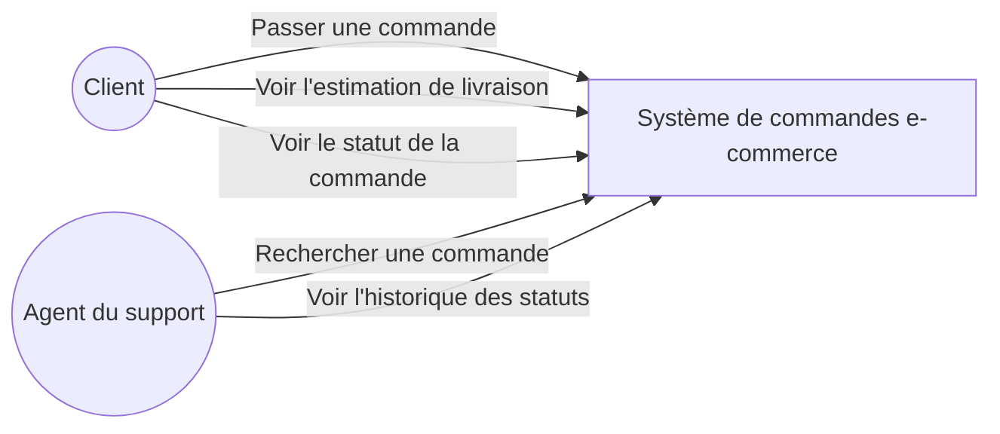

# Diagramme de cas d'utilisation de style UML

```mermaid
flowchart LR
Client((Client))
Support((Agent du support))
System[Système de commandes e-commerce]

Client -->|Passer une commande| System
Client -->|Voir l'estimation de livraison| System
Client -->|Voir le statut de la commande| System
Support -->|Rechercher une commande| System
Support -->|Voir l'historique des statuts| System
```
