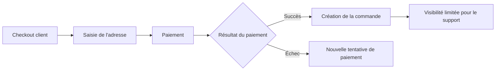
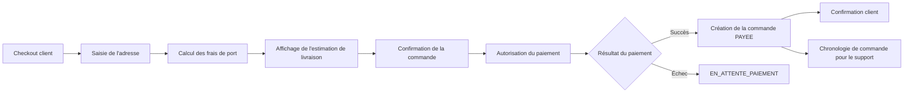

# Modèle de processus

## AS-IS (existant)

```mermaid
flowchart LR
A[Checkout client] --> B[Saisie de l'adresse]
B --> C[Paiement]
C --> D{Résultat du paiement}
D -->|Succès| E[Création de la commande]
D -->|Échec| F[Nouvelle tentative de paiement]
E --> G[Visibilité limitée pour le support]
```

## TO-BE (cible)

```mermaid
flowchart LR
A[Checkout client] --> B[Saisie de l'adresse]
B --> C[Calcul des frais de port]
C --> D[Affichage de l'estimation de livraison]
D --> E[Confirmation de la commande]
E --> F[Autorisation du paiement]
F --> G{Résultat du paiement}
G -->|Succès| H[Création de la commande PAYEE]
G -->|Échec| I[EN_ATTENTE_PAIEMENT]
H --> J[Confirmation client]
H --> K[Chronologie de commande pour le support]
```
