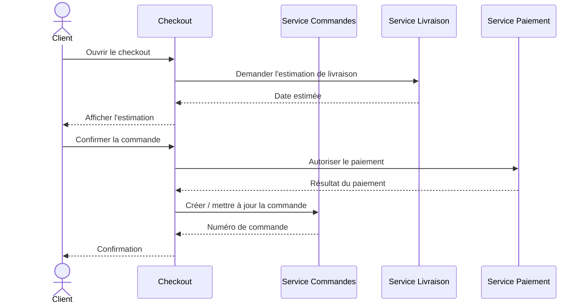

# Diagramme de séquence de style UML

```mermaid
sequenceDiagram
actor C as Client
participant UI as Checkout
participant O as Service Commandes
participant D as Service Livraison
participant P as Service Paiement

C->>UI: Ouvrir le checkout
UI->>D: Demander l'estimation de livraison
D-->>UI: Date estimée
UI-->>C: Afficher l'estimation
C->>UI: Confirmer la commande
UI->>P: Autoriser le paiement
P-->>UI: Résultat du paiement
UI->>O: Créer / mettre à jour la commande
O-->>UI: Numéro de commande
UI-->>C: Confirmation
```
