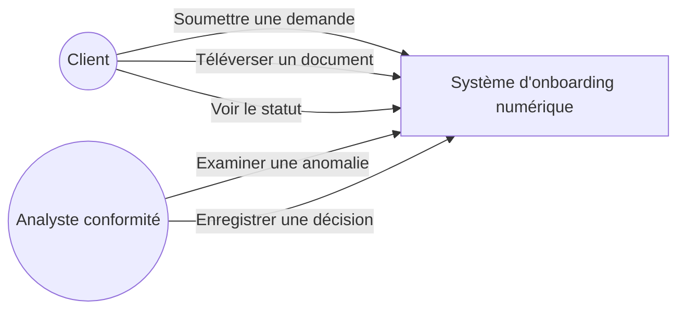

# Cas d'utilisation de style UML

```mermaid
flowchart LR
C((Client))
K((Analyste conformité))
S[Système d'onboarding numérique]

C -->|Soumettre une demande| S
C -->|Téléverser un document| S
C -->|Voir le statut| S
K -->|Examiner une anomalie| S
K -->|Enregistrer une décision| S
```
