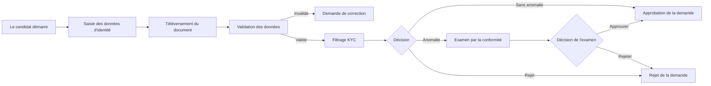

# Processus de style BPMN

```mermaid
flowchart LR
A[Le candidat démarre] --> B[Saisie des données d'identité]
B --> C[Téléversement du document]
C --> D[Validation des données]
D -->|Invalide| E[Demande de correction]
D -->|Valide| F[Filtrage KYC]
F --> G{Décision}
G -->|Sans anomalie| H[Approbation de la demande]
G -->|Anomalie| I[Examen par la conformité]
G -->|Rejet| J[Rejet de la demande]
I --> K{Décision de l'examen}
K -->|Approuver| H
K -->|Rejeter| J
```
