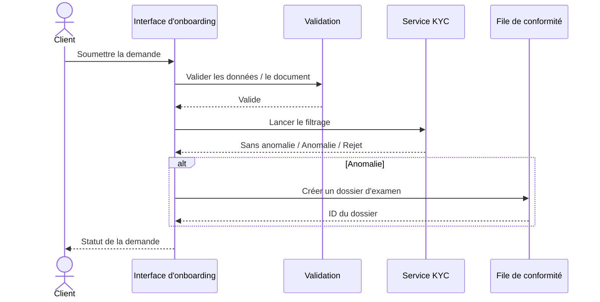

# Séquence

```mermaid
sequenceDiagram
actor C as Client
participant UI as Interface d'onboarding
participant V as Validation
participant K as Service KYC
participant Q as File de conformité

C->>UI: Soumettre la demande
UI->>V: Valider les données / le document
V-->>UI: Valide
UI->>K: Lancer le filtrage
K-->>UI: Sans anomalie / Anomalie / Rejet
alt Anomalie
    UI->>Q: Créer un dossier d'examen
    Q-->>UI: ID du dossier
end
UI-->>C: Statut de la demande
```
